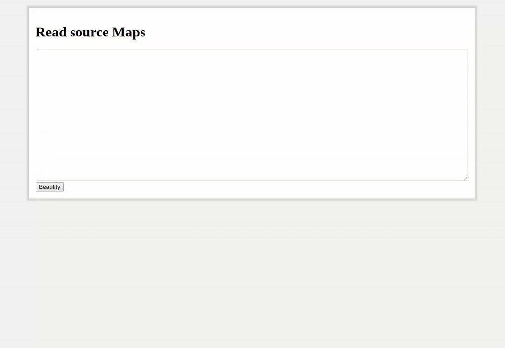

# Read source Maps

Inject a minify source maps and convert it to a dev sourcemap.

## Requirements

- node.js >= **v9** (async/await)

## Install

`$ npm i`

## Usage

`$ npm run server`

> Server port: 1442

## Dev

`$ npm start`
